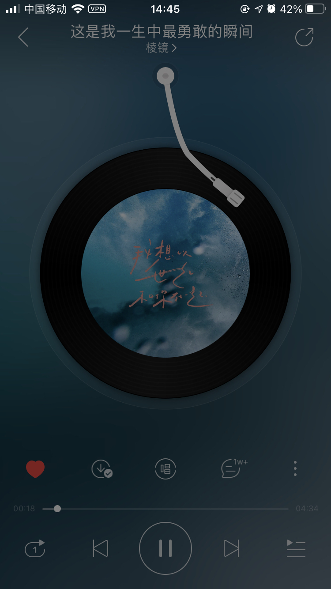

## Suono

Suono 是一个业务型音频库，比如音乐 app，付费音频 app 等业务场景，兼容至安卓浏览器原生浏览器。实际上线产品参考 Screenshot 一节。

保留了一定的拓展性，有任何场景需要欢迎 PR & Issues。

[![npm][npm]][npm-url]
[![node][node]][node-url]
![typescript][typescript]
[![xo][xo]][xo-url]
[![prs]][prs-url]
[![builds][builds]][builds-url]


## Feature

- 支持单例模式，全局实例共享
- 支持发布订阅模式，提供了所有的音视频事件的回调钩子，基于 MDN 的事件列表
- 内置了四种播放模式的实现，顺序播放、列表循环、单曲循环、随机播放
- 支持自定义播放模式
- 渐进增强和优雅降级

## Example

### 单例模式

```html
<script type="module">
  import { SingleTonSuono } from '../dist/index.esm.js'
  var suono = new SingleTonSuono({
    mode: 'random'
  })
  var suono1 = new SingleTonSuono()
  console.log(suono1 === suono) // true
</script>
```

### 非单例模式

```html
<script type="module">
  import { Suono } from '../dist/index.esm.js'
  var suono = new Suono()
</script>
```

### 四种播放模式，

支持自定义播放模式，例如心动模式。

```html
<script type="module">
  import { Suono } from '../dist/index.esm.js'
  var suono = new Suono({
    mode: 'order' // 默认
    // mode: 'singleLoop' // 单曲循环
    // mode: 'random' // 随机播放
    // mode: 'listLoop' // 列表播放
  })
</script>
```

### 多文件类型支持和优雅降级

```js
<audio controls>
  <source src="myAudio.mp3" type="audio/mpeg">
  <source src="myAudio.ogg" type="audio/ogg">
  <p>Your browser doesn't support HTML5 audio. Here is
     a <a href="myAudio.mp4">link to the audio</a> instead.</p>
</audio>
```

## API

#### init({ src, name }: ListItem)

初始化播放，在内存中创建 audio 标签，注册订阅发布事件提供钩子，调用加载资源的方法

#### load()

加载资源，


#### play()


#### pause()


#### seek(target: number)


#### skipTo(listItem: ListItem)


#### canplay()


#### prev()


#### next()


#### switch({ name, src }: ListItem)


#### order()


#### singleLoop()


#### random()


#### listLoop()


#### getName(): string


#### getSrc(): string


#### getCurrentTime(): number


#### getList(): ListItem[]


#### updateName(name: string, src: string)


#### updateLoading(status: boolean)


#### updateDuration(duration: number)


#### updateStatus(status: boolean)


#### updateMode(mode: string)


#### updateList(list: ListItem[])


#### handleEvent()


#### handleLoadError({ code }: MediaError)


## Develop

```json
"scripts": {
  "prebuild": "del-cli dist",
  "esm": "tsc --module esnext && cpy dist/index.js dist --rename index.esm.js",
  "cjs": "tsc --module commonjs",
  "build": "npm run esm && npm run cjs",
  "test": "ava",
  "dev": "npm run build --watch",
  "lint": "xo --fix"
}
```

## Test

使用 ava.js 作为测试工具库，测试用例待完善。
- 自动化测试用例为 `test/test.js`
- 手动测试用例为 `test/index.html`

## Screenshot

[付费音频](https://wap.91160.com/vue/doctorlesson/detail.html?classId=177&fileId=5285890791108124016)


当然，实现一个音乐app 的播放逻辑也是可以的。此库的逻辑原型来源于网易云音乐。



## License

MIT

[prs]: https://img.shields.io/badge/PRs-welcome-brightgreen.svg
[prs-url]: https://webpack.js.org/contribute/
[npm]: https://img.shields.io/npm/v/webpack.svg
[npm-url]: https://npmjs.com/package/webpack
[node]: https://img.shields.io/node/v/webpack.svg
[node-url]: https://nodejs.org
[typescript]: https://img.shields.io/badge/-TypeScript-007ACC?style=flat-square&logo=typescript
[xo-url]: https://github.com/xojs/xo
[xo]: https://img.shields.io/badge/code_style-XO-5ed9c7.svg
[builds-url]: https://ci.appveyor.com/project/sokra/webpack/branch/master
[builds]: https://ci.appveyor.com/api/projects/status/github/webpack/webpack?svg=true
[builds2]: https://dev.azure.com/webpack/webpack/_apis/build/status/webpack.webpack
[builds2-url]: https://dev.azure.com/webpack/webpack/_build/latest?definitionId=3
[licenses-url]: https://app.fossa.io/projects/git%2Bhttps%3A%2F%2Fgithub.com%2Fwebpack%2Fwebpack?ref=badge_shield
[licenses]: https://app.fossa.io/api/projects/git%2Bhttps%3A%2F%2Fgithub.com%2Fwebpack%2Fwebpack.svg?type=shield